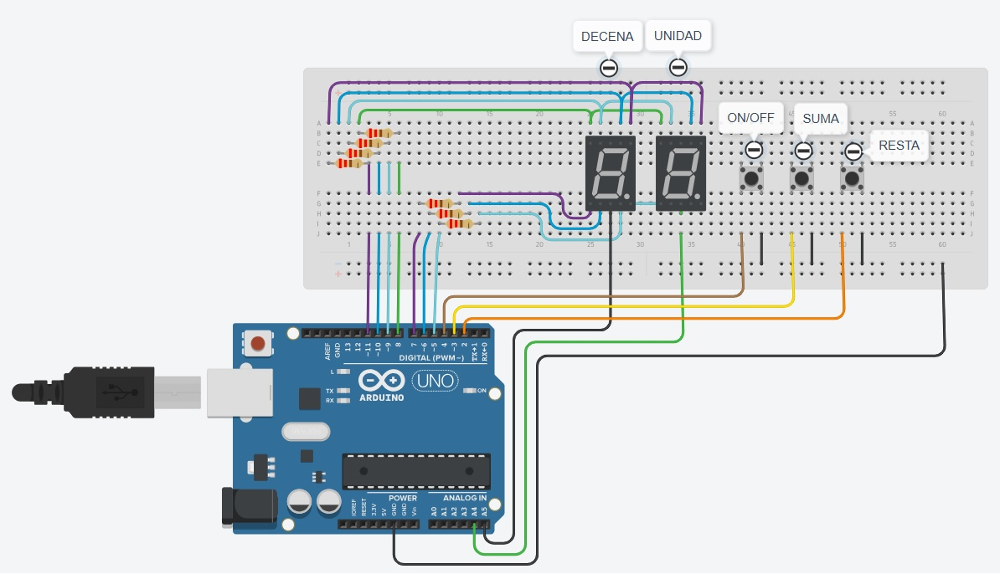

# Parcial domiciliario PARTE 1.

## Integrante: 
- Tomás León Curto Eivers

## Proyecto: Contador de dos digitos en Arduino.

## Descripción
Contador de 0 a 99 que utiliza dos displays de 7 segmentos para mostrar los dígitos en los displays. 
El contador comienza en 0 y es capaz de aumentar o disminuir su valor en una unidad con los pulsadores del medio y derecha respectivamente.
El primer pulsador maneja el encendido y apagado del sistema. 
Todas las resistencias son de 220 Ohm, ambos 7 segmentos son ánodo común, todos los pulsadores estan configurados como pullup interno antirrebote. 

## Funciones principales
Estas funciones se encargan de encender y apagar con el numero ingresado cada uno de los dos 7 segmentos con su digito respectivamente.

UNIDAD y DECENA son #define que utilizamos para conectar al common de cada 7 segmentos respectivamente, asociandolos a pines de la placa arduino.

~~~ C++ (lenguaje en el que esta escrito)
void unidad(int numero){
  digitalWrite(UNIDAD, HIGH); // Enciende el display en el pin UNIDAD.
  if (numero%10==0){
  	prenderCero(); //forma un 0 en el display 7 segmentos.
  }
  if (numero%10==1){
  	prenderUno(); //forma un 1 en el display 7 segmentos.
  }
  if (numero%10==2){
  	prenderDos(); //forma un 2 en el display 7 segmentos.
  }
  if (numero%10==3){
  	prenderTres(); //forma un 3 en el display 7 segmentos.
  }
  if (numero%10==4){
  	prenderCuatro(); //forma un 4 en el display 7 segmentos.
  }
  if (numero%10==5){
  	prenderCinco(); //forma un 5 en el display 7 segmentos.
  }
  if (numero%10==6){
  	prenderSeis(); //forma un 6 en el display 7 segmentos.
  }
  if (numero%10==7){
  	prenderSiete(); //forma un 7 en el display 7 segmentos.
  }
  if (numero%10==8){
  	prenderOcho(); //forma un 8 en el display 7 segmentos.
  }
  if (numero%10==9){
  	prenderNueve(); //forma un 9 en el display 7 segmentos.
  }
  apagar(); // apaga todos los leds.
  digitalWrite(UNIDAD, LOW); // apaga el display del pin UNIDAD.
}

void decena(int numero){
  digitalWrite(DECENA, HIGH);// Enciende el display del pin DECENA.
  if (numero/10>=0&&numero/10<1){
  	prenderCero(); //forma un 0 en el display 7 segmentos.
  }
  if (numero/10>=1&&numero/10<2){
  	prenderUno(); //forma un 1 en el display 7 segmentos.
  }
  if (numero/10>=2&&numero/10<3){
  	prenderDos(); //forma un 2 en el display 7 segmentos.
  }
  if (numero/10>=3&&numero/10<4){
  	prenderTres(); //forma un 3 en el display 7 segmentos.
  }
  if (numero/10>=4&&numero/10<5){
  	prenderCuatro(); //forma un 4 en el display 7 segmentos.
  }
  if (numero/10>=5&&numero/10<6){
  	prenderCinco(); //forma un 5 en el display 7 segmentos.
  }
  if (numero/10>=6&&numero/10<7){
  	prenderSeis(); //forma un 6 en el display 7 segmentos.
  }
  if (numero/10>=7&&numero/10<8){
  	prenderSiete(); //forma un 7 en el display 7 segmentos.
  }
  if (numero/10>=8&&numero/10<9){
  	prenderOcho(); //forma un 8 en el display 7 segmentos.
  }
  if (numero/10>=9&&numero/10<10){
  	prenderNueve(); //forma un 9 en el display 7 segmentos.
  }
  apagar(); //apaga todos los leds.
  digitalWrite(DECENA, LOW); // apaga el display del pin DECENAS.
}
~~~

## :robot: Link al proyecto
- [proyecto](https://www.tinkercad.com/things/1eSR2HMqnlC-1-parcial-domiciliario-parte-1-curto-eivers-tomas-leon/editel?sharecode=bqA1U-p1rdNLuh-v8rGiyNX_y7jZung-v_2p1N8etR4)

---
### Fuentes
- [Botón antirrebote con Arduino](https://www.youtube.com/watch?v=FoTFJW5Hyz8).

- [MULTIPLEXACIÓN DISPLAY 7 SEGMENTOS CON ARDUINO](https://www.youtube.com/watch?v=bScD6wptNws&t=188s).

---
