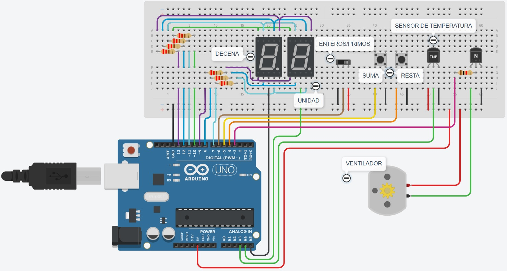

# Parcial domiciliario PARTE 2.

## Integrante: 
- Tomás León Curto Eivers

## Proyecto: Contador de dos digitos en Arduino.

## Descripción
contador de 0 a 99 utilizando dos displays de 7 segmentos (ánodo común) y dos botones para controlar la cuenta y un switch para mostrar solo numeros primos o todos los enteros.
Se utiliza la técnica de multiplexación para mostrar los dígitos en los displays. 
El contador debe comienza en 0 y es capaz de aumentar o disminuir su valor en una unidad o al siguiente numero primo.
Todas las resistencias son de 220 Ohm exepto la del transitor que es de 1kOhm, los pulsadores son de tipo pullup interno.
Ademas se agrego un motor CC (teoricamente funcionando como ventilador) el cual es regulado por el sensor de temperatura.
Cuando la temperatura es mayor al número mostrado en el display se activa el motor, y a mayor temperatura mayor velocidad de giro del mismo.

## Funciones principales
Esta función se encargan de todos los controles del circuito.

SWITCH y MOTOR son #define que utilizamos para conectar al common de cada 7 segmentos respectivamente, asociandolos a pines de la placa arduino.

~~~ C++ (lenguaje en el que esta escrito)
//LOOP
void loop()
{  
  //VERIFICO SI EL MODO ES NORMAL O PRIMOS:
  estado_switch = digitalRead(SWITCH);// detecta el estado del switch.

  //RESET SI CAMBIO DE MODO:
  if (estado_switch_anterior != estado_switch)// detecta si se movio el switch desde la vuelta anterior.
  {
    if (estado_switch == LOW)//Detecta si el switch esta en modo normal.
    {  
  		numero = 0;//Resetea al entero mas bajo.
    }
    else //Detecta si el switch esta en modo primos.
    {
    	numero = 2;//Resetea al primo mas bajo.
    }
    estado_switch_anterior = estado_switch;//actualiza el comparador para que la proxima vuelta no haya cambios.
  }
  
  //PRESION DE PULSADOR ANTI-REBOTE PULLUP INTERNO "SUMA":
  pulsado_suma = digitalRead(SUMA);// detecta si se presiona el pulsador.
  if (pulsado_suma == LOW)// pregunta si se esta presionando el pulsador.
  {
  	estado_suma = 1;// cambia de valor la variable estado.
  }
  if (estado_suma == 1 && pulsado_suma == HIGH)// pregunta si el estado es 1 pero se solto el boton.
  {
    if (estado_switch == LOW)//Detecta si el switch esta en modo normal.
    {  
  		suma_normal();
    }
    else //Detecta si el switch esta en modo primos.
    {
    	suma_primos();
    }
    estado_suma = 0;// devulve al estado original.
  }
  
  //PRESION DE PULSADOR ANTI-REBOTE PULLUP INTERNO "RESTA":
  pulsado_resta = digitalRead(RESTA);// detecta si se presiona el pulsador.
  if (pulsado_resta == LOW)// pregunta si se esta presionando el pulsador.
  {
  	estado_resta = 1;// cambia de valor la variable estado.
  }
  if (estado_resta == 1 && pulsado_resta == HIGH)// pregunta si el estado es 1 pero se solto el boton.
  {
  	if (estado_switch == LOW)//Detecta si el switch esta en modo normal.
    {  
  		resta_normal();
    }
    else //Detecta si el switch esta en modo primos.
    {
    	resta_primos();
    }
    estado_resta = 0;// devulve al estado original.
  }
  
  decena(numero); // muestra el digito de la decena.
  unidad(numero); // muestra el digito de la unidad.
    // se utiliza el metodo de Multiplexación por el cual
    // se encieden y apagan de forma alternada los displays
    // por medio de los pines A4 y A5, a una velocidad tal que
    // el ojo humano percibe los dos prendidos al mismo tiempo.
  apagar(); // apaga los displays
  delay(15);// retraso de 15ms. agiliza el cambio en los leds 
  
//FUNCIONAMIENTO SENSOR Y MOTOR  
  //LEO LA TEMPERATURA:
  lectura = analogRead(SENSOR);
  temperatura = map(lectura,20,358,-40,125);
  velocidad = map(temperatura,0,125,0,255);
  
  //EL SISTEMA SOLO SE ACTIVARA SI LA TEMPERATURA ES MAYOR A LA QUE SE MUESTRA EN EL DISPLAY.
  if (temperatura > numero)
  {
   	analogWrite(MOTOR,velocidad); 
  }
  else
  {
  	analogWrite(MOTOR,LOW); 
  }
  Serial.println(lectura);
}  
~~~

## :robot: Link al proyecto
- [proyecto](https://www.tinkercad.com/things/8EqaQuKfZCr-parcial-domiciliario-parte-2-curto-eivers-tomas-leon/editel?sharecode=gW3qVVkJ8H19MRim1g1GA_4fM_Ddx8fALvfGq2lQcYw)

---
### Fuentes
- [Botón antirrebote con Arduino](https://www.youtube.com/watch?v=FoTFJW5Hyz8).

- [MULTIPLEXACIÓN DISPLAY 7 SEGMENTOS CON ARDUINO](https://www.youtube.com/watch?v=bScD6wptNws&t=188s).

- [Slideswitch](https://www.youtube.com/watch?v=cFFwFCuSZN4).

- [Temperature-Controlled Cooling](https://www.youtube.com/watch?v=mtB97aFkdHs).

- [CONTROL DE UN MOTOR DE CORRIENTE CONTINUA CON ARDUINO EN TINKERCAD](https://www.youtube.com/watch?v=fJKPeiwi0Pc&t=843s).
---
